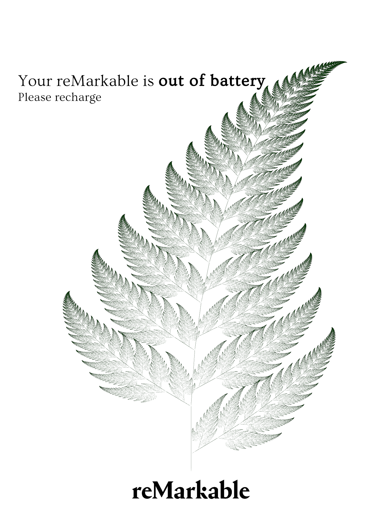
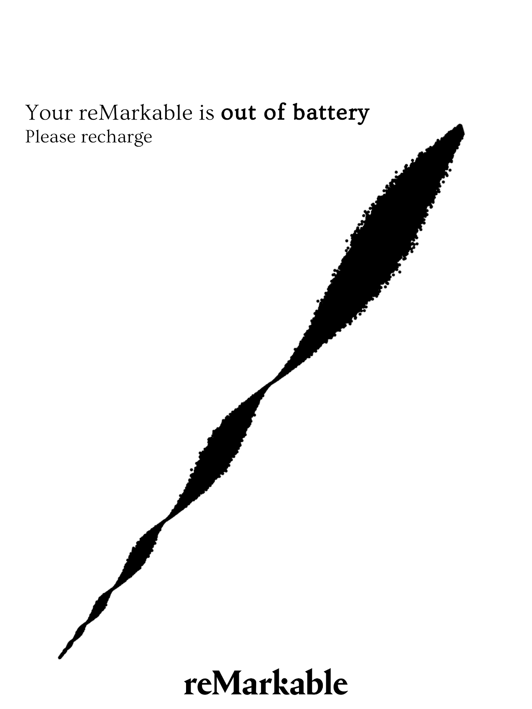
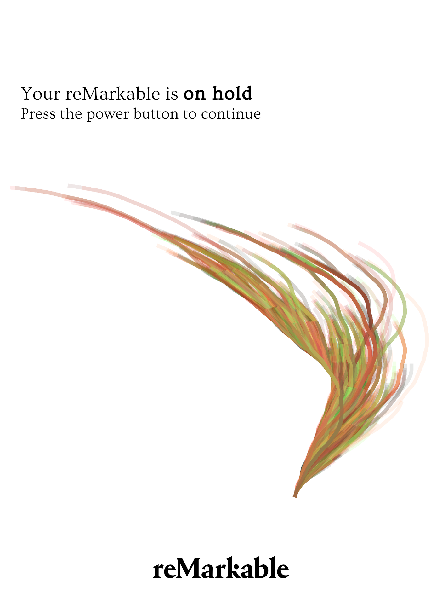
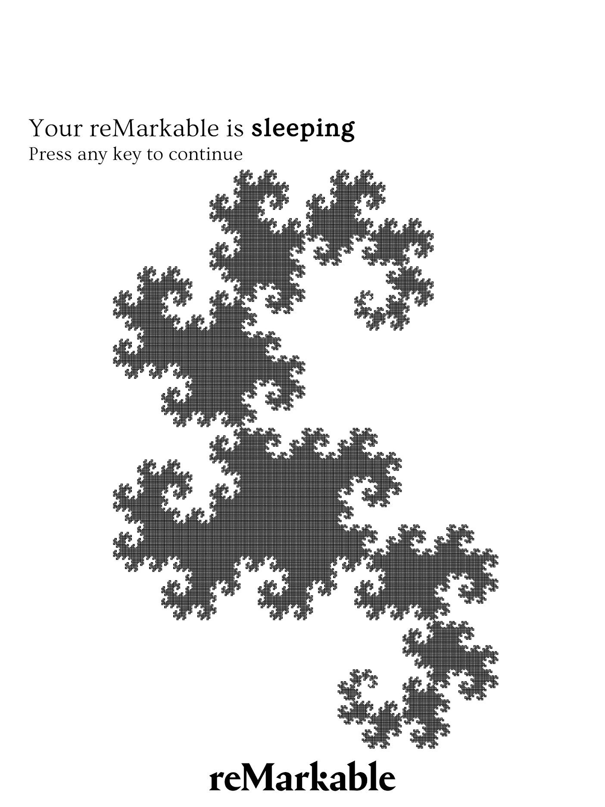
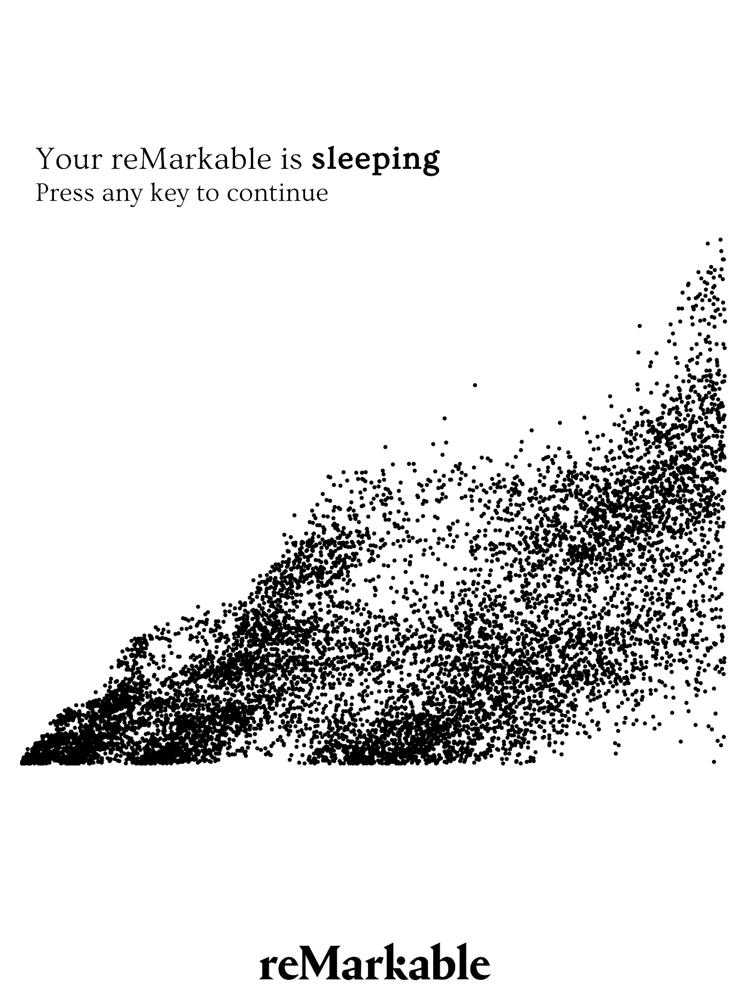
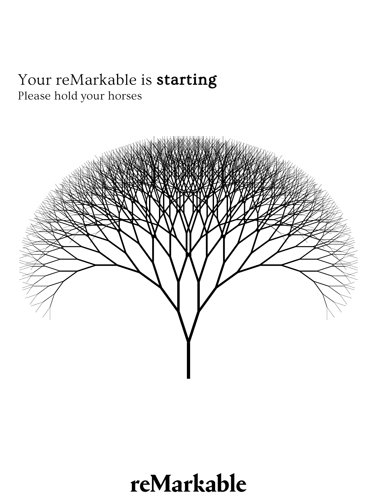
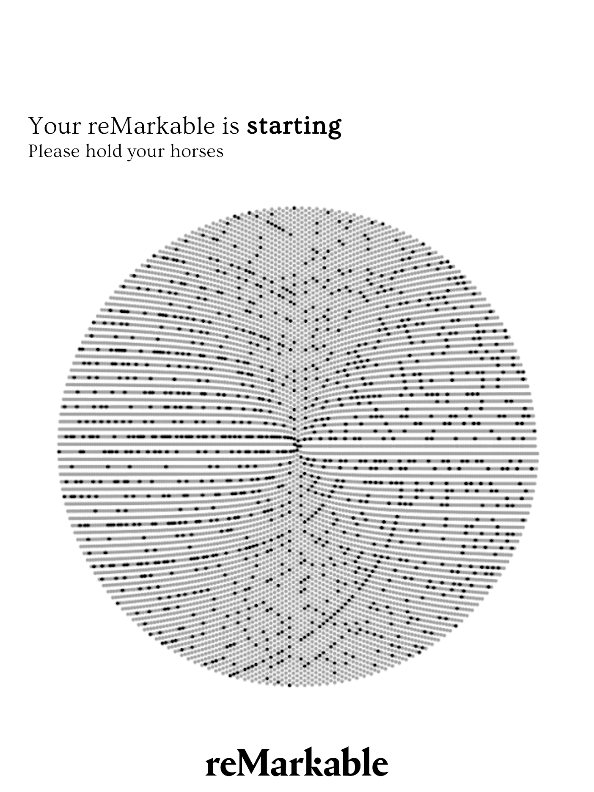
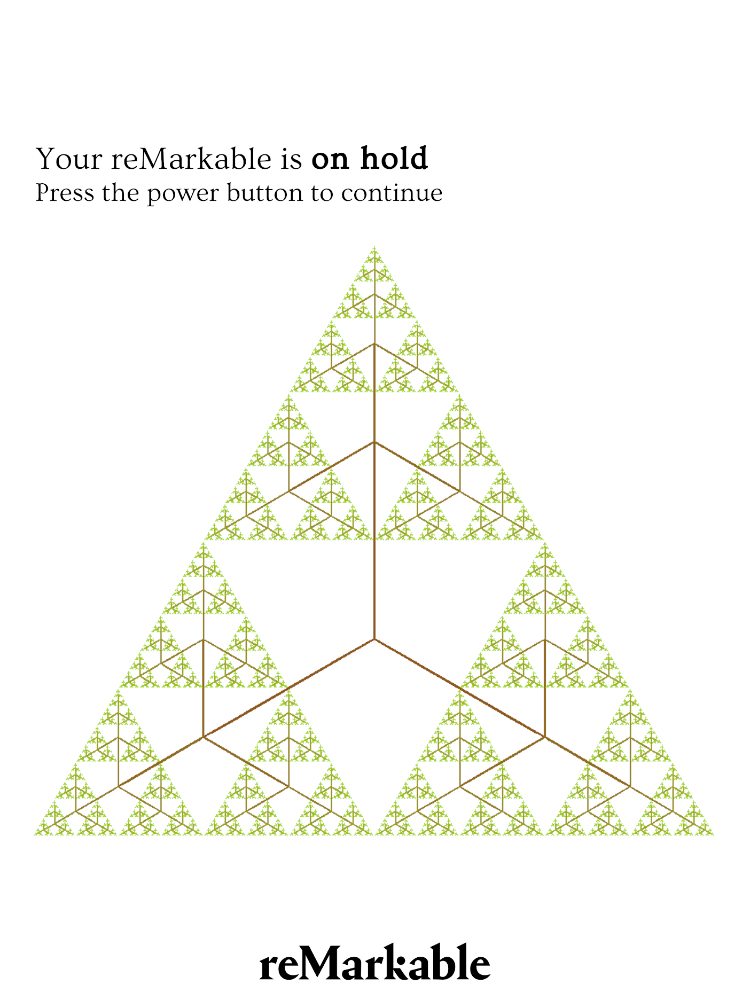
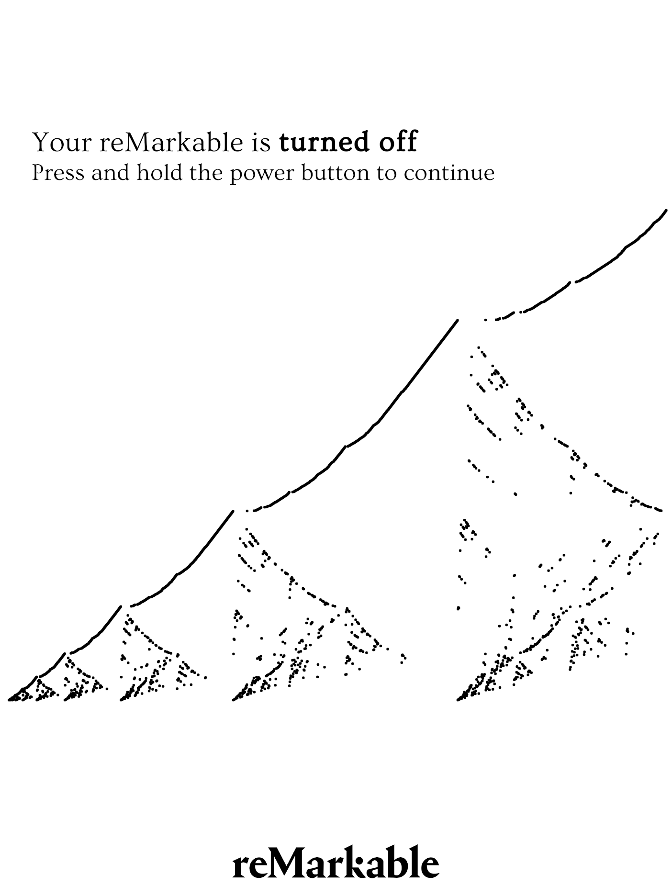

<h1 align="center">Splash screens for the reMarkable tablet</h1>

## Contents
- [Info](#info)
- [About](#about)
- [Log in](#login)
- [Adding new splash screens](#addnew)
- [Auto install with script](#autoinstall)
- [Lookbook](#lookbook)

## Info <a name = "info"></a>

This repository contains a bunch of `png` files with the correct ratio to be used as
backgrounds or splash screens in the [reMarkable paper tablet](https://remarkable.com/).

Many of the images in the splash screens are made using `python` and `matplotlib`. Have
a look at the scripts [here](https://github.com/engeir/maths_snack) and experiment for
yourself.

## About <a name = "about"></a>

Some of the original files can be found in this repository, in the folder
[originals](originals). But before you delete a file and replace it with a new one, be
sure to check if it is there, and preferably make your own backup.

All splash screens can be found in [splashscreens](splashscreens), with a folder for each
kind. The images used in the splash screens are found in [backgrounds](backgrounds) and
a [template](template.xcf) file is also provided with correct dimensions, so that new
files can be easily made.

## Log in <a name = "login"></a>

To log in to the reMarkable, `SSH` into the address given on the bottom of the section
_General information_ in the _Copyrights and licenses_ file. E.g.

```sh
ssh root@10.0.1.17
```

and type in the password, given in the same file as the address, e.g. `pswrd123`.

## Adding new splash screens <a name = "addnew"></a>

To copy the original files from reMarkable to your computer (for backup) use

```sh
scp root@10.0.1.17:/usr/share/remarkable/filename.png /path/to/filename.png
```

You then want to log in to the tablet and delete all files you want to replace, using

```sh
rm -f filename.png
```

You can now copy a new file from your computer to the same place in the reMarkable by
doing

```sh
scp /path/to/filename.png root@10.11.99.1:/usr/share/remarkable/filename.png
```

## Auto install with script <a name = "autoinstall"></a>

Using the shell script `rm-splash.sh` you can more easily add new splashscreens to your
reMarkable. Run as

```sh
sh rm-splash.sh
```

This will install the default backgrounds: `sacks_spiral`, `dragon_curve`, `snowy_hills`,
`collatz_sea_weed` and `sierpinski_triangle`. Edit the shell script yourself to get
whatever files and backgrounds you prefer.

## Lookbook <a name = "lookbook"></a>

### [Barnsley Fern](splashscreens/barnsley_fern)

### [Chaotic Ribbon](splashscreens/chaotic_ribbon)

### [Seaweed from Collatz Algorithm](splashscreens/collatz_sea_weed)

### [Dragon Curve](splashscreens/dragon_curve)

### [Forest Fire](splashscreens/fire)

### [Fractal Tree](splashscreens/fractal_tree)

### [Sacks Spiral](splashscreens/sacks_spiral)

### [Sierpinski triangle](splashscreens/sierpinski_triangle)

### [Snowy Hills](splashscreens/snowy_hills)

